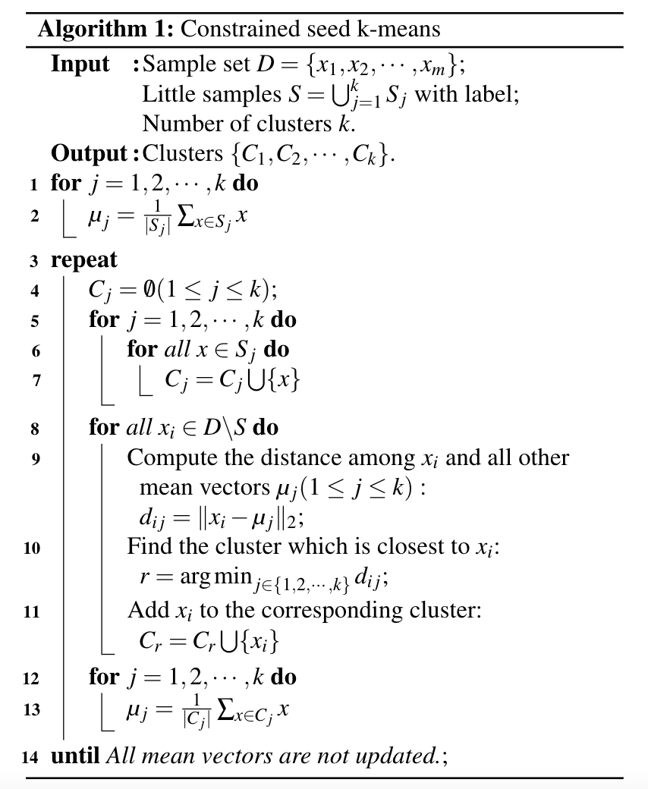

# Implement constrained seed k-means algorithm from scratch

## Algorithm introduction
The [k-means](https://en.wikipedia.org/wiki/K-means_clustering) algorithm is a widely used unsupervised machine learning algorithm for clustering. In unsupervised machine learning, no samples have labels. But in many practical applications, users usually have a little samples with ground-truth label. So we could utilize these labels to do a more accurate clustering, and this is where semi-supervised clustering algorithms come from. 

*Constrained seed k-means* algorithm is a classical semi-supervised clustering algorithm. These samples with true label are called *seed samples*. The main differences between this algorithm and k-means algorithm lie in two aspects, which are:

1. **centroids initialization** : instead of randomly choosing k samples from training dataset as the initial centroids, in constrained seed k-means algorithm, it uses the seed samples with the same label to form the initial cluster and then calculate the mean vector within that cluster as the initial centroids. 

2. **cluster updating** : instead of updating the associated cluster index for each sample, in constrained seed k-means algorithm, the associated cluster index for those seed samples does not change in all iterations. 

The algorithm details are shown below.




## Usage 
You can use the class `ConstrainedSeedKMeans` in `seed_kmeans.py` to do both kmeans clustering and constrained seed kmeans clustering.

For example, if all our samples has no label, then `ConstrainedSeedKMeans` is same as `k-means`:

``` python
import numpy as np
from seed_kmeans import ConstrainedSeedKMeans


dataset = np.genfromtxt('./watermelon_4.0.txt', delimiter=',')
X = dataset[:, 1:]
y = [-1 for _ in range(X.shape[0])]

kmeans = ConstrainedSeedKMeans(n_clusters=3, n_init=10, verbose=False)
kmeans.fit(X, y)
print(kmeans.indices)
```
where we use **`-1`** to indicate samples with no label. 

We can assign label to some samples as:
``` python
y = [-1 for _ in range(X.shape[0])]
y[3], y[24] = 0, 0
y[11], y[19] = 1, 1
y[13], y[16] = 2, 2
```
then we can perform constrained seed k-means:

``` python
seed_kmeans = ConstrainedSeedKMeans(n_clusters=3, n_init=10, verbose=False)
seed_kmeans.fit(X, y)
print(seed_kmeans.indices)
```


## Reference
[1] Basu, Sugato, Arindam Banerjee, and Raymond Mooney. "Semi-supervised clustering by seeding." In Proceedings of 19th International Conference on Machine Learning (ICML-2002. 2002.

